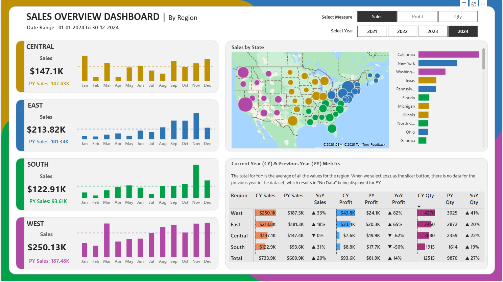

# 📊 Dynamic Regional Sales Dashboard in Power BI

## 📌 Overview
This project is an **interactive Power BI dashboard** that tracks **Sales**, **Profit**, and **Quantity** across four U.S. regions: **Central, East, South, and West**.

It allows users to:
- Filter data by **year**.
- Dynamically switch between **Sales, Profit, and Quantity**.
- Compare **Sales** with the **Previous Year (PY)**.
- View monthly trends with **bar sparklines** and an **average line** for better trend analysis.
- Drill down to **region-specific performance**.

---

## 📂 Repository Structure
```

📁 PowerBI-Orders-Dashboard
│
├── 📂 data
│   ├── Sample - Superstore.xls         # dataset
│
├── 📂 pbix
│   ├── Sales Overview Report.pbix  # Power BI report file
│
├── 📂 images
│   ├── dashboard_overview.png # Screenshot of full dashboard
│
├── README.md             # Project documentation

````

---

## 📊 Key Features
- **Dynamic Metric Selection** – Toggle between Sales, Profit, and Quantity.
- **Year Filter** – Adjust data to any selected year.
- **Previous Year Comparison** – Compare performance year-over-year.
- **Monthly Trend Analysis** – Bar sparkline with average line.
- **Region-wise Insights** – Central, East, South, and West breakdowns.
- **Data Integration** – Orders, People, and Returns datasets linked.

---

## 📂 Dataset Details
We use three CSV files:

1. **orders.csv** →  
   Contains sales transaction data including:
   - Order ID, Order Date, Ship Date
   - Ship Mode, Customer Info
   - Region, Product Category & Sub-Category
   - Sales, Quantity, Discount, Profit

2. **people.csv** →  
   Region managers and their respective regions.

3. **returns.csv** →  
   Boolean field for whether an order was returned.

---

## 🛠 Tools & Technologies
- **Power BI Desktop** – Data modeling, DAX, and visualization.
- **DAX Measures** – For dynamic metric selection and PY calculations.
- **Power Query Editor** – For data cleaning and transformation.

---

## 🧮 DAX Highlights

**Dynamic Metric Selection**
```DAX
Selected Metric =
SWITCH(
    SELECTEDVALUE(Metric[MetricName]),
    "Sales", SUM(Orders[Sales]),
    "Profit", SUM(Orders[Profit]),
    "Quantity", SUM(Orders[Quantity])
)
````

**Previous Year Sales**

```DAX
PY Sales =
CALCULATE(
    SUM(Orders[Sales]),
    SAMEPERIODLASTYEAR(Orders[Order Date])
)
```

---

## 📸 Dashboard Preview



---

🔗 **View Interactive Dashboard:** [Power BI Online Link](https://app.powerbi.com/view?r=eyJrIjoiYzBlYjg4MGQtMDFkNy00ODIxLTk0YmMtMTUwZjY1NjhiOTkwIiwidCI6IjVkNmI5ZmM3LWJiZjktNDM5YS04ZWQ0LWNmMjhjY2JiNzFkOCJ9)

---

💡 *Created as a portfolio project to demonstrate Power BI data modeling, DAX, and dashboard design.*
